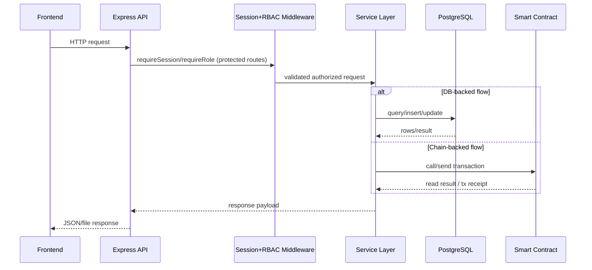

# Lab 2 Workspace

This lab focuses on local Ethereum accounts, balances, nonces, and native ETH transfers on the Hardhat node.

## Main guide

- [Lab 2 master guide](../../docs/lab2/Lab2.md)

## Components

- `api/`: Node API for account snapshots, latest block data, and transfers
- `frontend/`: static UI for balances, nonce changes, and transaction flow

## Quick start

```bash
docker compose up -d chain lab2-api lab2-frontend
```

Open:

- Frontend: `http://localhost:8081`
- API health: `http://localhost:3001/api/health`

## Sequence Diagram

