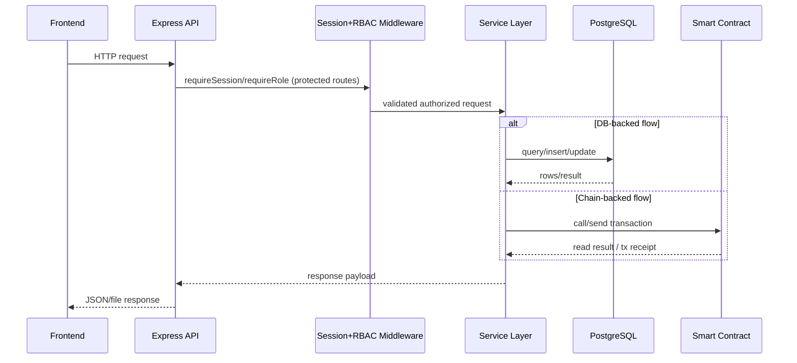

# Lab 3 Workspace

This lab introduces the first full smart-contract DApp in the course: a classroom voting system with fixed proposals, one-address-one-vote, a deadline, and contract event history.

## Main guide

- [Lab 3 master guide](../../docs/lab3/Lab3.md)

## Components

- `blockchain/`: Solidity contract, Hardhat config, deployment script, and test
- `api/`: Node API for election state, voter snapshots, history, and vote transactions
- `frontend/`: static UI for voting, proposal totals, deadline state, and vote history

## Quick start

```bash
docker compose up -d chain lab3-api lab3-frontend
docker compose run --rm lab3-deployer
```

Open:

- Frontend: `http://localhost:8082`
- API health: `http://localhost:3002/api/health`

## Sequence Diagram

