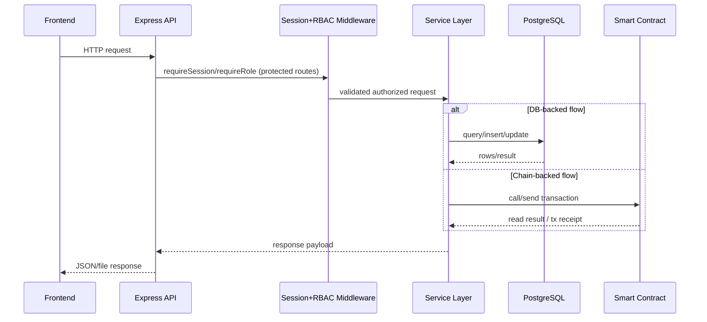

# Lab 4 Workspace

This lab introduces a practical certificate registry and compares blockchain proof mechanisms. You will issue, verify, and revoke certificate hashes through a deployed Solidity contract.

## Main guide

- [Lab 4 master guide](../../docs/lab4/Lab4.md)

## Components

- `blockchain/`: Solidity contract, Hardhat config, deployment script, and tests
- `api/`: Node API for registry state, certificate actions, history, and proof data
- `frontend/`: static UI for proof comparison, issuing, verifying, revoking, and event history

## Quick start

```bash
docker compose up -d chain lab4-api lab4-frontend
docker compose run --rm lab4-deployer
```

Open:

- Frontend: `http://localhost:8083`
- API health: `http://localhost:3003/api/health`

## Sequence Diagram

