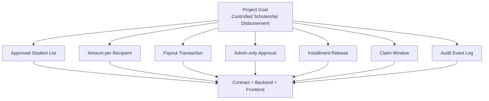
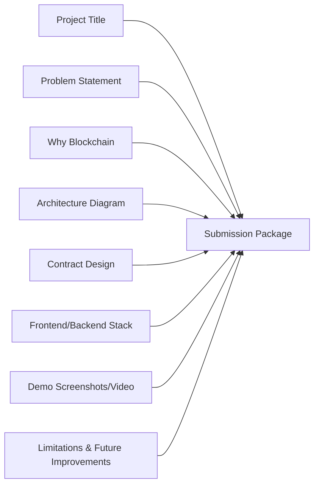
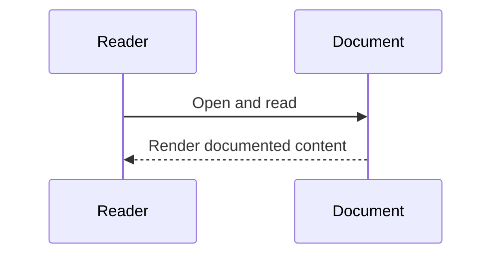

# Requirements Analysis from `specifications/BlockChain Project 26.xlsx`

## 1) Project Assignment (Exact Match)
- Assigned Student: **Ahmed Banby (Ahmed ElBamby)**
- Project Title: **Scholarship Approval and Release Contract**
- Category: **Finance / Education**
- Objective: **Manage scholarship approvals and controlled fund release to approved students**

## 2) Functional Requirements (from sheet: `All_50_Projects`)

### Core Features
1. Approved student list
2. Amount per recipient
3. Payout transaction
4. Admin-only approval

### Bonus Features
1. Installment release
2. Claim window
3. Audit event log

### Suggested Stack
- Solidity payable contract
- Hardhat
- ethers.js
- Admin/student dashboard

### Evaluation Focus
- Payout correctness
- Access control
- Edge-case handling
- Event transparency
- Demo reliability

## 3) Submission/Documentation Requirements (from sheet: `Submission_Grading`)
1. Project title
2. Problem statement
3. Why blockchain is appropriate
4. System architecture diagram
5. Smart contract design
6. Frontend/backend stack
7. Demo screenshots or video
8. Limitations and future improvements

## 4) Requirement Decomposition

| ID | Requirement | Type | Acceptance Signal |
|---|---|---|---|
| R1 | Approved student list | Functional | API/contract exposes approved students |
| R2 | Amount per recipient | Functional | Per-student amount stored and retrievable |
| R3 | Payout transaction | Functional | Student can claim released installment and receive transfer |
| R4 | Admin-only approval | Security | Unauthorized approver is rejected |
| R5 | Installment release | Functional (Bonus) | Release is installment-based and ordered |
| R6 | Claim window | Functional (Bonus) | Claims after deadline are rejected/recoverable |
| R7 | Audit event log | Observability (Bonus) | Contract emits lifecycle events; optional persistence |
| R8 | Solidity+Hardhat+ethers+admin/student dashboards | Architecture | Stack traceable in codebase |
| R9 | Full documentation package | Delivery | Required write-up sections complete |

## 5) Current System Requirement Coverage (High-Level)

| Requirement | Current Status | Evidence (Code Paths) |
|---|---|---|
| R1 | Covered | `getApprovedStudents`, `/api/scholarships/approved` |
| R2 | Covered | `Scholarship.totalAmount`, approval payload `amountWei` |
| R3 | Covered | `claimInstallment`, payable transfer |
| R4 | Covered | `onlyOwner`, custom unauthorized error |
| R5 | Covered | `releaseInstallment` with sequence enforcement |
| R6 | Covered | `claimDeadline`, `Claim window closed`, recover expired |
| R7 | Covered | approval/funding/release/claim/recover events + Supabase inserts |
| R8 | Covered | Solidity + Hardhat + ethers + admin/student pages |
| R9 | Partial | Docs exist, but submission-oriented package still has gaps |

## 6) Mermaid Requirement Map

## 7) Documentation Requirements Traceability

## Sequence Diagram

