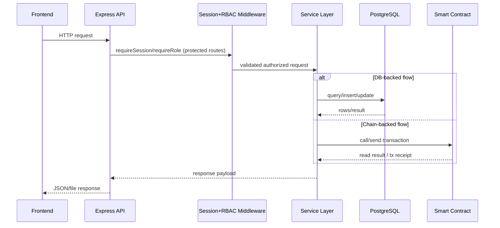

# Identity Baseline from reference Labs

## 1) Architectural Identity

- Tri-layer teaching architecture:
- blockchain layer (Hardhat + Solidity)
- API layer (Express + ethers)
- frontend layer (vanilla HTML/CSS/JS)
- Clear local-first runtime assumptions (`127.0.0.1:8545` and lab-specific API ports).
- Explicit role modeling (issuer/admin/student/verifier) as first-class flow concept.
- Event-driven audit explanations surfaced to UI/API consumers.

## 2) Backend Code Identity

Observed in `reference Labs/labs/lab{1..4}/api/src/server.js`:

- ESM imports and top-level constants.
- `express()` + `app.use(cors())` + `app.use(express.json())` baseline.
- Explicit helper sections (provider construction, artifact/deployment loading, error normalization, validators).
- Guarded request parsing with readable error messages.
- Contract adapter creation via `new ethers.Contract(address, abi, provider|signer)`.
- Deterministic response builders (summary/detail/history serialization).
- Strong educational comments explaining why each step exists.

## 3) Solidity Code Identity

Observed in `reference Labs/labs/lab{1,3,4}/blockchain/contracts/*`:

- `pragma solidity ^0.8.24;`
- Heavily sectioned comments (data model, access model, write operations, read operations, audit trail).
- Explicit modifiers for authority checks (`onlyIssuer`/owner-like patterns).
- Events for every meaningful state change.
- Read paths separate from write paths; informative `require` messages.
- Structured state using structs + mappings with explicit counters.

## 4) Frontend Identity

Observed in `reference Labs/labs/lab{1..4}/frontend/*`:

- Frameworkless UI.
- Large explicit DOM handle declarations by element id.
- Central `runtime` state object.
- Dedicated render helpers and UX helper functions (`escapeHtml`, short formatting, event feed utilities).
- Step-wise async flows using small composable functions.
- Teaching-oriented labels, status cards, and explicit workflow hints.

## 5) Naming & Organization Identity

- Lab modules grouped by concern: `api/`, `blockchain/`, `frontend/`.
- Deployment metadata and artifacts treated as loadable runtime dependencies.
- File names are direct and role-based (`server.js`, `deploy.js`, `app.js`).
- Variables emphasize intent over brevity (`registryRules`, `proofMechanisms`, `getRegistrySummary`).

## 6) Behavior Boundaries to Preserve

- Validation errors remain user-readable and precise.
- Access control remains enforced on-chain, not only in API.
- Contract events remain consumable as audit trail.
- Frontend state updates remain deterministic after async operations.
- API remains explicit about success/error without hidden implicit behavior.

## Sequence Diagram

