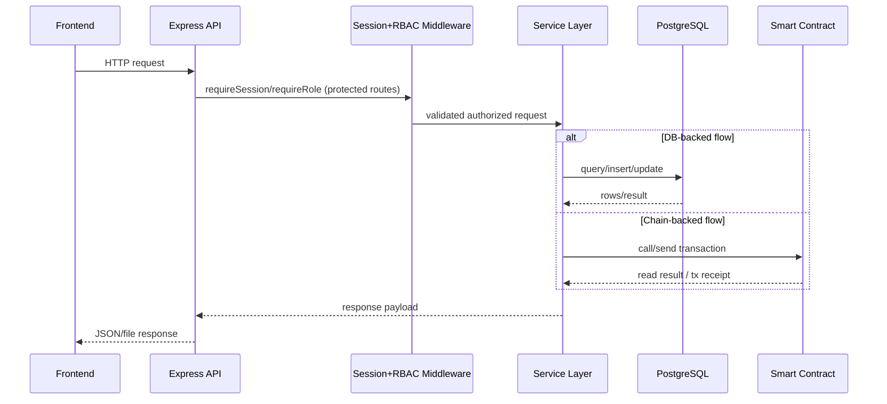

# Refactor Checklist (Identity + Feature Preservation)

## A) Pre-Refactor Snapshot

- List user-visible features and endpoints.
- List contract functions/events used by backend/frontend.
- Capture request/response shapes for each API route.
- Capture critical UI interactions and expected states.

## B) Identity Alignment Actions

- Backend:
- Group helpers by concern (provider, artifact loading, validation, serialization).
- Keep explicit input validation and normalized error handling.
- Contract integration through one adapter boundary.

- Contract:
- Keep sectioned comments and explicit access control modifiers.
- Keep event emission coverage for state transitions.
- Keep readable require messages and invariant checks.

- Frontend:
- Keep explicit DOM element map.
- Keep pure render/helper functions.
- Keep deterministic state transitions around async actions.

## C) Wiring Validation

- Frontend routes resolve correctly from static host.
- API base path logic does not double-prefix routes.
- Backend RPC URL and contract address resolution works in local and Docker modes.
- Contract signer/provider selection matches privileged vs read-only calls.

## D) Regression Validation

- Run frontend tests.
- Run backend API tests.
- Run contract unit/integration/system tests.
- Add tests for any changed behavior boundary.

## E) Exit Criteria

- No feature loss.
- No API shape regressions.
- Identity alignment documented for each changed module.
- All relevant tests pass.

## Sequence Diagram

